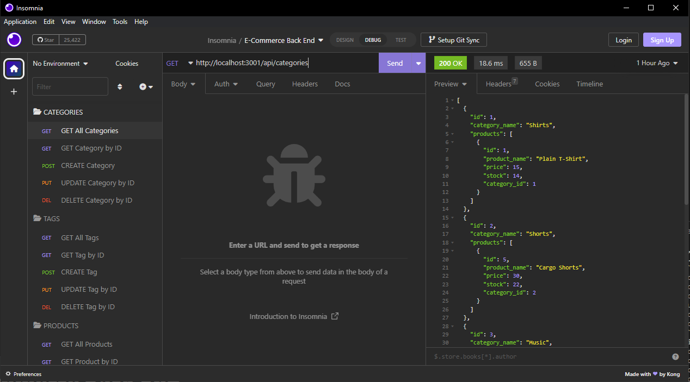

# **E-Commerce Back End**


## **Description**

This project was the creation of a back-end environment for an E-Commerce business. This was done using mysql2, sequelize, express, dotenv and node.js. The goal was to be able to create products, categories for those products, and tags for those products and then tie them all together. The front-end was provided but all the models and routes needed to be filled out. 

Video link to app in action: https://watch.screencastify.com/v/gPzXIlapmQVJQswgXnsn

---

## **Table of Contents**

* [Installation](#installation)

* [Screenshot](#screenshot)

* [Usage](#usage)

* [License](#license)

* [Contributing](#contributing)

* [Tests](#tests)

* [Questions](#questions)

---

## **Installation**

To install the needed dependencies, run the following commands:

```
npm i 
```

Then create your .env file with your SQL information, then source the database

```
in mysql: source db/schema.sql
```

Then seed the database with node 

```
node seeds/index.js
```

Video of App: https://watch.screencastify.com/v/gPzXIlapmQVJQswgXnsn

---

## **Screenshot**



Video of App: https://watch.screencastify.com/v/gPzXIlapmQVJQswgXnsn

---

## **Usage**

This is open source and can be used as you see fit. It can be modified to fit your needs or if you want to expirement with it feel free. If you'd like to add any features just submit them as issues to the repo.

---

## **License**

This project is licensed under the MIT license.

---

## **Contributing**

You can contribute to this project by either opening issues on the github repo or by emailing me directly at my contact info below.

---

## **Tests**

To test the project, run the following commands:

```
N/A
```

---

## **Questions**

If you have any questions about the project or repo, contact me directly at justincodingclass@gmail.com or open an issue on the repo. You can find my github profile with this project and others at [github.com/jwatkins28](https://github.com/jwatkins28/)
